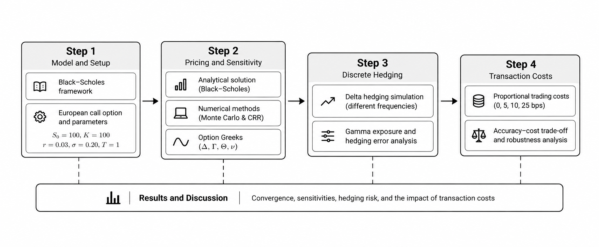
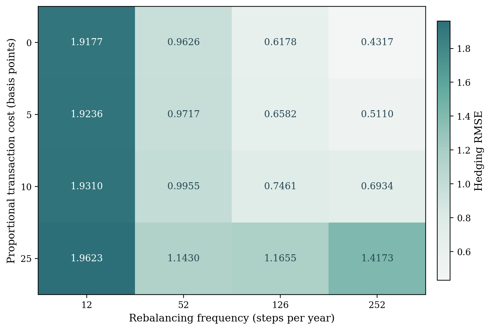

# Numerical Option Pricing and Dynamic Delta Hedging

**A fully reproducible quantitative-finance research project on convergence, convexity exposure, and transaction costs.**

Zhengli Ji · Applied Mathematics, Xi'an Jiaotong-Liverpool University · October 2026

[](https://github.com/zhengli0426/option-pricing-delta-hedging/actions/workflows/tests.yml)
[](https://github.com/zhengli0426/option-pricing-delta-hedging/releases/tag/v1.0.4)
[](LICENSE)

[Paper](paper/paper.pdf) · [Getting started](docs/getting-started.md) · [Research guide](docs/research-guide.md) · [Reproducibility](docs/reproducibility.md) · [Methods](docs/methods.md)

This project studies a European call under the Black-Scholes framework using analytical pricing, Monte Carlo simulation, the Cox-Ross-Rubinstein (CRR) tree, Greeks, discrete delta hedging, integrated Gamma exposure, and proportional transaction costs. The contribution is computational and integrative rather than a claim to a new pricing model or a live trading strategy.




## Release

Current portfolio release: **v1.0.4**. Package metadata and citation metadata use version `1.0.4`; the fixed experiment configuration is labelled `1.0.4-reproducible`. See the [v1.0.4 release](https://github.com/zhengli0426/option-pricing-delta-hedging/releases/tag/v1.0.4).

## Key findings

The committed full study is generated entirely from the current source code and `config/study.json`.

| Question | Reproducible result | Interpretation |
| --- | --- | --- |
| Monte Carlo convergence | MAE slope **-0.526**, 95% CI **[-0.577, -0.476]**, R² **0.997** | Consistent with the expected square-root convergence rate. |
| CRR convergence | Even-step error slope **-0.999** with clear odd-even oscillation | Approximately first-order for this European-call setup. |
| Discrete hedging | Frictionless RMSE falls from **1.9177** (12 steps) to **0.4317** (252 steps) | More frequent rebalancing reduces discretisation error in the tested frictionless model. |
| Gamma exposure | Weekly scenario-level Pearson **r = 0.903**, bootstrap 95% CI **[0.709, 0.990]** | Larger cumulative convexity exposure is associated with larger hedging RMSE; this is descriptive, not causal. |
| Transaction costs | At 25 bps, weekly RMSE is **1.1430** versus **1.4173** for daily hedging | Trading costs can reverse the frictionless frequency ranking within the tested grid. |



## Reproduce the study

Use Python 3.11 or later. For the closest environment match, install the pinned scientific stack in `requirements-lock.txt`.

### Windows PowerShell

```powershell
python -m venv .venv
.\.venv\Scripts\python.exe -m pip install -r requirements-lock.txt
.\.venv\Scripts\python.exe -m pip install -e . --no-deps
.\.venv\Scripts\python.exe -m pytest
.\.venv\Scripts\python.exe -m option_hedging reproduce --force
```

### macOS / Linux

```bash
python3 -m venv .venv
.venv/bin/python -m pip install -r requirements-lock.txt
.venv/bin/python -m pip install -e . --no-deps
.venv/bin/python -m pytest
.venv/bin/python -m option_hedging reproduce --force
```

The last command rebuilds the complete `reproducible/` directory: CSV data, statistical summaries, paper figures, LaTeX result macros/tables, metadata, the semantic seed manifest, and a SHA-256 manifest for deterministic scientific outputs.

To independently regenerate the study into a separate directory and compare it with the committed manifest:

```bash
python -m option_hedging verify --force
```

A smaller development smoke run is available with:

```bash
python -m option_hedging reproduce --quick --output results/quick
```

`--quick` is not the paper dataset.

## Single-source pipeline

```text
config/study.json
        |
        v
src/option_hedging/
        |
        +--> Monte Carlo / CRR / Greeks / hedge simulations
        |
        v
reproducible/data/*.csv
        |
        +--> reproducible/statistics.json
        +--> reproducible/figures/*.png
        +--> reproducible/paper_values.tex
        +--> reproducible/tables/*.tex
        |
        v
paper/main.tex  --->  paper/paper.pdf
```

The manuscript imports generated numerical values and tables directly from `reproducible/`. There is no second archived numerical dataset and no separate set of paper-only stochastic results.

## Repository structure

```text
config/study.json          Fixed experiment specification
src/option_hedging/        Pricing, Greeks, hedging, statistics, plots, pipeline
reproducible/              Committed outputs used by the paper
paper/                     LaTeX manuscript, bibliography, static methodology diagram, PDF
tests/                     Model, simulation, pipeline, documentation checks
docs/                      Methods, reproducibility and onboarding notes
requirements-lock.txt      Exact scientific package versions used for the committed run
.github/workflows/         Automated tests and reproducibility smoke checks
```

## What is deterministic?

Fixed experiment labels are converted to stable random seeds from the master seed `20260925`. The paper bootstrap uses seed `20260923`. The committed scientific outputs carry SHA-256 provenance fingerprints in `reproducible/manifest.json`. Cross-machine verification compares primary numeric outputs with tight floating-point tolerances (`rel=1e-10`, `abs=5e-12`) and generated text byte-for-byte. For CRR tables, derived signed, absolute, and percentage-error columns are validated as within-run identities rather than compared directly across machines, because subtraction can amplify harmless last-bit differences. The reference CI environment pins Python 3.13.5 and the package versions in `requirements-lock.txt`. PNG pixels may differ slightly across plotting/rendering stacks, and wall-clock runtime is intentionally excluded.

## Paper compilation

The committed PDF is `paper/paper.pdf`. To rebuild it locally after regenerating the study:

```bash
cd paper
latexmk -pdf main.tex
```

The LaTeX source reads generated values from `../reproducible/`, so keep the repository structure intact when compiling or upload both `paper/` and `reproducible/` to Overleaf.

## Scope and limitations

The model assumes a non-dividend-paying underlying, constant volatility and interest rates, risk-neutral GBM dynamics, European exercise, and symmetric proportional trading costs. The reported cost convention charges only internal rebalancing trades; it excludes the initial stock-purchase charge and terminal liquidation. It excludes stochastic volatility, jumps, empirical calibration, market impact, liquidity constraints, and adaptive hedging. The integrated Gamma measure is a convexity-exposure proxy, not an exact decomposition of hedge-error variance or a causal estimator.

## Citation and reuse

If referring to the study, cite Zhengli Ji (2026), *Numerical Option Pricing and Dynamic Delta Hedging: Convergence, Convexity Exposure, and Transaction Costs*. Bibliographic metadata is in `CITATION.cff`. This is a project manuscript; no journal publication or DOI is claimed.

## License

This repository is released under the [MIT License](LICENSE).
